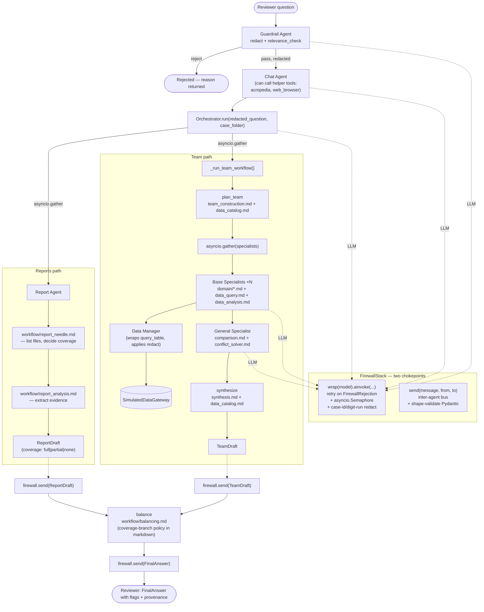

# Current Architecture (refreshed 2026-04-24, post-phase-0a..9)

Snapshot of the system after the skills-refactor branch (`phase-0a-langchain-async`) lands. Supersedes the earlier pre-refactor snapshot. Captures the per-question pipeline and the agent/tool/skill boundaries as they exist today.

## What's present

- **Async throughout.** Every agent method that touches the LLM is `async`. LangChain `ChatOpenAI` is the wrapped model. `FirewalledModel.ainvoke` preserves the legacy `(system_prompt, user_message, tools, output_type) -> LLMResult` surface.
- **Two parallel branches per question.** Reports path (curated `results/<case-id>/*.md`) and Team path (specialist dispatch → peer review → synthesis) run via `asyncio.gather`. The Balancing skill merges the drafts — policy lives in `skills/workflow/balancing.md`, not in Python.
- **Input-side Guardrail.** Reviewer questions route through `GuardrailAgent.screen()` first — redact identifiers + reject off-topic before any orchestration work starts.
- **Data-side Data Manager.** Wraps the gateway with redaction + fronts the catalog skill. Orchestrator and Data Manager both inline the `data_catalog.md` body to ground team selection and synthesis in real table/column names.
- **Firewall as bus.** `firewall.send(message, from_agent, to_agent)` applies redact patterns + shape-validates every inter-agent transit. Shared `asyncio.Semaphore` caps concurrent LLM calls on fan-out.
- **Helpers as tools.** `helper/acropedia.md` + `helper/web_browser.md` bound to the Chat Agent's LLM via `bind_tools`. Acropedia has a stub adapter with canned entries; web browser is a placeholder until the fetch layer lands.
- **Skills as markdown.** All prompts (7 domain + 13 workflow + 2 helper = 22 total) live in `skills/{workflow,domain,helper}/*.md` with YAML frontmatter for structured fields. `skills/loader.py` parses + filters by owner.

## What's still transitional

- **No LangGraph.** The parallel branches use raw `asyncio.gather`. A future phase (Phase 0c in the spec) builds a proper `StateGraph` wrapping the same topology.
- **Web browser helper is a placeholder.** Returns a "not yet available" message until the fetch layer is wired in.
- **Acropedia is a stub.** Canned entries for DTI, FICO, WCC, CBR, PD. Swap in the real internal-platform client later.
- **`FinalOutput` kept as `TeamDraft` alias.** Some external callers may still import `FinalOutput`; remove the alias once none remain.
- **Data Manager is not yet in the specialist hot path.** Base Specialists currently call `query_table` directly via `bind_tools`. Wiring specialists through `DataManagerAgent.query` so ALL data access applies the redact policy is a follow-up — the class and its skill are in place.

## What this diagram is for

Reference snapshot at the end of the skills-refactor branch. The original pre-refactor snapshot (sequential, Python-module-based) is preserved in the git history at commit `084983b` if side-by-side comparison is needed.
