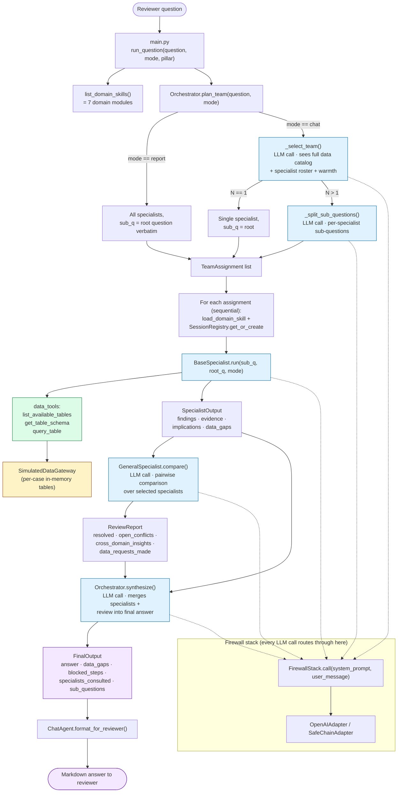

# Current Architecture (snapshot 2026-04-23)

Snapshot of the system before the skills/parallel-paths refactor. Captures the per-question pipeline and the agent/tool boundaries as they exist today.

## Notes

- **Synchronous throughout.** `firewall.call`, all agents, the per-assignment loop, and the per-pair comparison loop are blocking. No `asyncio`, no threads.
- **One mode flag drives planning.** `mode == "report"` short-circuits team selection (everyone gets the root question). `mode == "chat"` runs the two-step LLM planning (select → split).
- **Domain skills are Python.** `skills/domain/*.py` modules expose a `get_skill()` factory returning a `DomainSkill` dataclass (`system_prompt`, `data_hints`, `risk_signals`, `decision_focus`, `prompt_overlay`).
- **Tools live in `tools/data_tools.py`.** Specialists call `query_table` directly through normal Python — there is no LLM-driven tool-call protocol yet.
- **Session warmth is a tiebreaker.** `SessionRegistry` tracks which specialists have been instantiated; `_select_team` is told about warmth but instructed not to let it override data relevance.
- **No prior-report consultation.** Today nothing reads `results/<case-id>/`. The team workflow is the only answer source.

## What this diagram is for

Reference snapshot for the next-version design (`2026-04-23-orchestrator-skills-refactor-design.md`, forthcoming). Compare side-by-side to see what the parallel Reports-path + Balancing-skill change adds and what stays the same.
