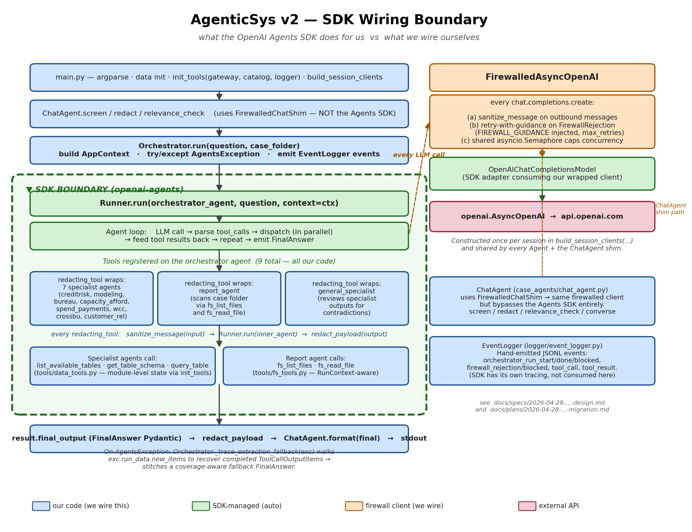

# Overview

This document draws a clean line between two layers of AgenticSys v2:

- **What the OpenAI Agents SDK does for us automatically** — the agent loop,
  tool dispatch, parallelism, structured-output parsing.
- **What the SDK does NOT do — and how we wire it ourselves** — the LLM client
  layer, inter-agent transit redaction, beta fallback, dependency injection,
  instructions composition, the pre/post pipeline, ChatAgent, and the
  Orchestrator wrapper class.

The goal is to make it obvious where to look when something needs tuning or
debugging.

{ width=100% }

> The diagram above is the visual companion to the textual sections below.
> Blue boxes are our code; green is SDK-managed (auto-wired); amber is the
> firewall client we wire on the LLM transport layer; rose is the external
> OpenAI API. The dashed green container marks the SDK boundary — everything
> inside `Runner.run` is the SDK's responsibility; everything outside is ours.
> Regenerate with `python brainstorm/_sdk_wiring_diagram.py`.

# Part 1 — What the SDK wires automatically

The SDK runs the **agent loop** for us — that is its core value. Inside one
`Runner.run(agent, input, context=...)` call, the SDK does all of the
following without our code touching it:

| What the SDK does | Concretely |
|---|---|
| **The loop itself** | LLM call -> check for tool_calls -> dispatch tools -> feed results back as messages -> repeat until LLM emits a final structured output (or hits `max_turns`). |
| **Tool dispatch** | Given an LLM-emitted `tool_call`, finds the matching `FunctionTool` by `name`, deserializes JSON args against `params_json_schema`, calls `tool.on_invoke_tool(ctx, args)`, serializes the return into the next LLM message. |
| **Parallel tool execution** | When the LLM emits multiple `tool_calls` in one response, the SDK schedules them concurrently (`asyncio.gather` under the hood). No `await asyncio.gather` in our code — the SDK does it. |
| **`ctx` injection** | The `context=AppContext(...)` argument to `Runner.run` is auto-threaded into every tool whose first parameter is typed `ctx: RunContextWrapper[AppContext]`. The `ctx` param is also stripped from the JSON schema the LLM sees. |
| **Structured output parsing** | `output_type=AgentOutputSchema(FinalAnswer, ...)` tells the SDK to (a) pass `FinalAnswer`'s JSON schema as OpenAI's `response_format`, (b) parse the response JSON into a `FinalAnswer` Pydantic instance, (c) expose it as `result.final_output`. |
| **Agent-as-tool** | `agent.as_tool(tool_name, tool_description)` produces a `FunctionTool` that, when invoked, internally runs `Runner.run(inner_agent, ...)`. This is how nested agent dispatch works. |
| **Run-history bookkeeping** | The SDK accumulates `RunItem`s (`ToolCallItem`, `ToolCallOutputItem`, `MessageOutputItem`) as turns progress, and exposes them on `result.new_items`. On exception, it stashes them under `exc.run_data.new_items` for partial-trace inspection. |
| **Model invocation** | `OpenAIChatCompletionsModel(model="gpt-4o", openai_client=...)` is the SDK-provided adapter that converts the SDK's internal message format into the OpenAI `chat.completions.create` API call. |

# Part 2 — What the SDK does NOT wire — we do, ourselves

Anything outside the agent loop, anything customizing how the LLM client
behaves, and anything that touches infrastructure beyond the SDK's awareness.

## 2.1 The LLM client itself (`llm/firewall_client.py` and `llm/safechain_client.py`)

The SDK calls `openai_client.chat.completions.create(...)` to talk to OpenAI.
We *substitute* a wrapped client. **Two implementations**, selected by
`build_session_clients(backend=…)`:

- **`backend="openai"`** (dev/test) — `FirewalledAsyncOpenAI` wrapping
  `openai.AsyncOpenAI`:

  - Redacts PII from every outbound message before forwarding to the real
    client
  - Catches `FirewallRejection` and retries with `FIREWALL_GUIDANCE` injected
    into the system message (up to `max_retries`)
  - Acquires a shared `asyncio.Semaphore` around each request so global
    in-flight calls are capped

- **`backend="safechain"`** (private/prod) — `SafeChainAsyncOpenAI` mimics the
  same `AsyncOpenAI` shape but routes through SafeChain's
  `ValidChatPromptTemplate` chain:

  - Flattens multi-turn `messages` into a single human message with neutral
    role labels (`Context`, `Request`, `Response`, `Tool result`) — SafeChain
    requires single-message input
  - Injects a tool-schema text block when the SDK sends `tools=[...]`, since
    SafeChain has no native function-calling
  - Parses the LLM's `{"tool_call": …}` / `{"output": …}` JSON response and
    *synthesises* an OpenAI `ChatCompletion` Pydantic with a real
    `tool_calls=[…]` array, so the SDK never knows it isn't talking to a real
    OpenAI server
  - Refreshes the safechain model on HTTP 401 (token expiry); raises
    `FirewallRejection` on 403 / 400
  - Same retry-with-guidance + semaphore behaviour as the OpenAI path

The SDK has no idea either layer exists. It just sees an `AsyncOpenAI`-shaped
object. The agent architecture downstream — `Agent`, `Runner`, `redacting_tool`,
β fallback — is **identical** regardless of backend; only this HTTP-client
layer differs.

## 2.2 Inter-agent transit redaction (`case_agents/redacting_tool.py`)

When the orchestrator's LLM calls a specialist tool, the SDK passes the
LLM-generated string straight through to the inner agent. The SDK does not
transform or sanitize. We add that boundary ourselves: `redacting_tool` is a
`@function_tool` that wraps `Runner.run(inner_agent, ...)` with
`sanitize_message` on input and `redact_payload` on output. This is why every
sub-agent in the orchestrator's tool list is wrapped — without
`redacting_tool`, the inter-agent edges would be unredacted.

## 2.3 Beta trace-extraction fallback (`orchestrator/orchestrator.py`)

The SDK provides the data (`exc.run_data.new_items` after `AgentsException`),
but the *strategy* — "if the orchestrator fails after some specialists ran,
recover their `SpecialistOutput`s and stitch a coverage-aware fallback
`FinalAnswer`" — is hand-written in
`Orchestrator._trace_extraction_fallback`. The SDK gives us the parts; we
decide what to do with them.

## 2.4 Tool dependency injection for data tools (`tools/data_tools.py`)

The SDK supports per-request `RunContext` (which we use for `fs_tools`), but
for `data_tools` we kept the legacy module-level state pattern:

- `_gateway`, `_catalog`, `_logger` are module-level globals
- `main.py` calls `init_tools(gateway, catalog, logger)` once at session start
  before any `Runner.run`
- The decorated `query_table` etc. read from those globals at call time

The SDK does not know about this — to it, `query_table` is just a function
returning a string. The dependency injection is happening in our module's
lexical scope, invisible to the runtime.

## 2.5 Skill / instructions composition

Every Agent's `instructions=` is a static string we build at module-import
time by concatenating markdown bodies (`team_construction.md` +
`data_catalog.md` + ...). The SDK never reads files, never composes, never
refreshes — it just passes that exact string as the system prompt on every
turn. If you edit a markdown file, you must re-import the module to see the
change.

The composition functions
(`_compose_orchestrator_instructions`, `_compose_instructions` in
`specialist_agent.py`, etc.) live entirely outside the SDK's awareness.

## 2.6 The pre-orchestrator pipeline (`main.py`)

Everything that happens before `await Runner.run(...)` is hand-wired:

- CLI argparse
- Data layer init: `LocalDataGateway`, `DataCatalog`, `DataGenerator`
- Pillar config loading from YAML
- `init_tools(...)` to set the data-tool module globals
- `ChatAgent.screen(...)` for question-time content screening (uses
  `FirewalledChatShim`, **not** the Agents SDK)
- Case-folder resolution

After `Runner.run(...)` returns, we also do:

- `redact_payload(result.final_output)` (one last redaction at the
  SDK -> caller boundary)
- `ChatAgent.format(final)` to render the `FinalAnswer` as user-facing
  markdown

None of these run inside the SDK loop.

## 2.7 ChatAgent (entirely outside the SDK)

`case_agents/chat_agent.py`'s `screen`, `redact`, `relevance_check`,
`converse` methods do not use `Agent`/`Runner` at all. They make plain
`chat.completions.create` calls via the `FirewalledChatShim`
(`llm/factory.py`). The shim mimics the legacy
`FirewalledModel.ainvoke(system_prompt, user_message)` interface so
ChatAgent did not need to be rewritten. From the SDK's perspective, ChatAgent
is invisible — it is a separate code path that happens to share the
firewalled `AsyncOpenAI` client.

## 2.8 EventLogger

Our JSONL logger (`logger/event_logger.py`) is hand-written and called
explicitly from `Orchestrator.run` (`orchestrator_run_start`,
`orchestrator_run_done`, `orchestrator_run_blocked`),
`FirewalledAsyncOpenAI` (`firewall_rejection`, `firewall_blocked`), and
`data_tools` (`tool_call`, `tool_result`). The SDK has its own tracing
system (which we do not currently consume); both run side-by-side.

## 2.9 The Orchestrator class wrapper

The SDK gives you `Runner.run(agent, input)`. That is it. We wrap it in
`Orchestrator.run(question, case_folder, report_agent=None)` to:

- Build `AppContext` from session state
- Catch `AgentsException` for the beta fallback
- Apply the final redaction
- Emit our `EventLogger` events

The SDK has no concept of an "Orchestrator class" — that is our framing on
top.

# Mental model

```
   +------------------------------ our code -------------------------------+
   |  main.py: argparse, data init, init_tools, ChatAgent screening       |
   |     |                                                                 |
   |     v                                                                 |
   |  Orchestrator.run                                                     |
   |     |  builds AppContext, catches AgentsException                     |
   |     v                                                                 |
   |  +---------------- SDK boundary -----------------+                    |
   |  |  Runner.run(orchestrator_agent, ...)          |                    |
   |  |     |                                          |                    |
   |  |     v                                          |                    |
   |  |  agent loop:                                   |                    |
   |  |    LLM call ----> openai_client.chat...create  |                    |
   |  |    tool_call dispatch                          |                    |
   |  |    parallel scheduling                         |                    |
   |  |    structured output parsing                   |                    |
   |  |     |                                          |                    |
   |  |     v                                          |                    |
   |  |  result.final_output: FinalAnswer              |                    |
   |  +------------------------------------------------+                    |
   |     |                                                                 |
   |     v                                                                 |
   |  redact_payload, ChatAgent.format, return to caller                   |
   +-----------------------------------------------------------------------+

   Side channel running THE WHOLE TIME:
     openai_client = FirewalledAsyncOpenAI(real_AsyncOpenAI, firewall)
     |- redacts every outbound message
     |- retries on FirewallRejection with FIREWALL_GUIDANCE
     +- shared semaphore caps concurrency

   Each tool the SDK dispatches:
     - data_tools: read module-level globals set by init_tools
     - fs_tools: read AppContext via RunContextWrapper
     - sub-agents (via redacting_tool): sanitize input, run inner agent,
       redact output before SDK feeds it back to outer LLM
```

The SDK is the **dispatcher** — it owns the loop, parallelism, JSON
marshaling, and tool resolution. Everything else (transport-layer behavior,
inter-agent boundary security, instruction composition, dependency injection
patterns, the upstream / downstream pipeline, observability) is ours.

# Quick reference — where to look

| If you need to tune... | Look in |
|---|---|
| Orchestrator's high-level prompt | `case_agents/orchestrator_agent.py` -> `_compose_orchestrator_instructions` (incl. inline `TOOL-USE DISCIPLINE` block) |
| The skill prose itself | `skills/workflow/*.md`, `skills/domain/*.md` |
| Specialist instruction template | `case_agents/specialist_agent.py` -> `_compose_instructions` |
| What each tool looks like to the LLM | Tool docstring (`tools/data_tools.py`, `tools/fs_tools.py`) and tool descriptions in the orchestrator factory |
| HTTP-layer policy (redaction, retry, throttling) | `llm/firewall_client.py` |
| Inter-agent redaction | `case_agents/redacting_tool.py` |
| Beta fallback strategy | `orchestrator/orchestrator.py` -> `_trace_extraction_fallback` |
| Data tool dependencies (gateway/catalog/logger) | `tools/data_tools.py` -> `init_tools`, called once from `main.py` |
| Per-request context (case_folder, gateway) | `case_agents/app_context.py` -> `AppContext`, threaded by `Runner.run(context=...)` |
| Pre/post-orchestrator pipeline | `main.py` (`amain`, `_screen_and_run`, `run_question`) |
| ChatAgent's LLM calls | `llm/factory.py` -> `FirewalledChatShim` |
| Model + decoding choice | `llm/factory.py` -> `build_session_clients(model_name=...)` and `main.py` `--model` flag |
